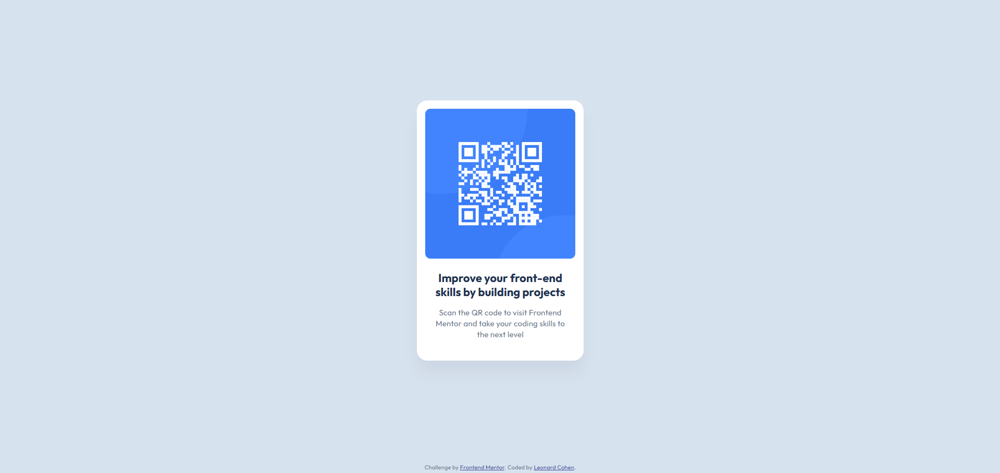

# Frontend Mentor - QR code component solution

This is a solution to the [QR code component challenge on Frontend Mentor](https://www.frontendmentor.io/challenges/qr-code-component-iux_sIO_H). Frontend Mentor challenges help you improve your coding skills by building realistic projects. 

## Table of contents

- [Overview](#overview)
  - [Screenshot](#screenshot)
  - [Links](#links)
- [My process](#my-process)
  - [Built with](#built-with)
  - [Implementation](#implementation)
  - [Continued development](#continued-development)
  - [Useful resources](#useful-resources)
- [Author](#author)

**Note: Delete this note and update the table of contents based on what sections you keep.**

## Overview

### Screenshot

### Links

- Solution URL: [https://github.com/lenny131/qr-code-component](https://github.com/lenny131/qr-code-component)
- Live Site URL: [https://lenny131.github.io/qr-code-component/](https://lenny131.github.io/qr-code-component/)

## My process

### Built with

- HTML and CSS

### Implementation

This project uses plain HTML and CSS without any additional libraries or frameworks.
I used semantic tags when possible, including the article element for the QR code component.
All styling is in main.css; index.html contains only the page content with no inline styles.

<!-- ### What I learned -->

### Continued development

My goal is to continue practicing HTML, CSS, and Javascript. Afterwards, I plan on learning React.

### Useful resources
- [web.dev](https://web.dev/)

## Author

- Website - [Leonard Cohen](https://leonardmcohen.com)
- Frontend Mentor - [lenny131](https://www.frontendmentor.io/profile/lenny131)

<!-- ## Acknowledgments -->
